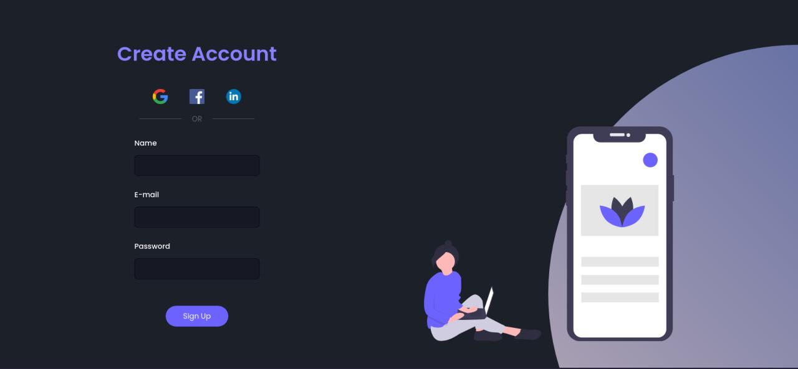

<h1 align="center">
    
</h1>

<h3 align="center">
    App developed through the @giovannamoeller tutorial to practice HTML5 and CSS3 and their properties.
</h3>

<p align="center">
  

  

  <a href="https://github.com/Gilles30/sign-up-form.git/commits/master">
    
  </a>
    
   
   <a href="https://github.com/Gilles30/sign-up-form.git/stargazers">
    
  </a>

  <a href="https://github.com/Gilles30">
    
  </a>
  
 
</p>

<h4 align="center"> 
	 Status: Finished
</h4>

<p align="center">
 <a href="#about">About</a> •
 <a href="#features">Features</a> •
 <a href="#layout">Layout</a> • 
 <a href="#how-it-works">How it works</a> • 
 <a href="#tech-stack">Tech Stack</a> • 
 <a href="#contributors">Contributors</a> • 
 <a href="#author">Author</a> • 
 <a href="#user-content-license">License</a>

</p>

## About

:neckbeard: [loading-page-simple](https://github.com/Gilles30/sign-up-form.git) - A registration page created during the tutorial [giovannamoeller](https://github.com/giovannamoeller) [tutorial-youtube](https://www.youtube.com/watch?v=Q68vbJplf7I).

---

## Features

- [x] Code structure:

  - [x] HTML: index
  - [x] CSS: style
  - [x] Readme

---

## Layout

The layout was developed by: [giovannamoeller](https://github.com/giovannamoeller)

---

## How it works

This project is done in a single part:

1. front-end

HTML

This project was made to train HTM and CSS;

### Requirement

Before you begin, you will need to have the basic html5 structure created in your project
[TutorialHTML](https://tutorialehtml.com/pt/), [TutorialCSS](https://www.w3schools.com/css/default.asp).
Also, it’s good to have an editor to work with the code like [VSCode](https://code.visualstudio.com/)

#### Running (Frontend)

```bash

# Clone this repository
$ git clone github.com/Gilles30/sign-up-form.git

# Access the project folder on your terminal
$ cd sign-up-form.git

# Open the folder where it was saved
$ double-click the index.js file

# The file will open in the browser locally

```

---

## Tech Stack

The following tools were used in the construction of the project:

- **[HTML](https://html.com/)**
- **[CSS](https://www.maujor.com/)**

---

## Contributors

A big thank you, and my congratulations to the developer of this tutorial [Girl Coding](https://www.youtube.com/watch?v=Q68vbJplf7I) that is and will help many people to understand that programming is not a seven-headed bug, just dedicate yourself and follow people like [@giovannamoeller](https://github.com/giovannamoeller) :)

Incredible professionals :)

<hr/>

<table>
  <tr>
    <td align="left"><a href="https://github.com/giovannamoeller"><br /><sub><b>Giovanna Moeller / Girl Coding</b></sub></td>
    
  </tr>

  <div>
  <p>
   Follow on Instagram, on Youtube (don't forget to activate the bell to follow all the content)
  </p>

[](https://www.instagram.com/girl.coding/) [](https://www.youtube.com/watch?app=desktop&v=MkXuQ9CcHqU&feature=youtu.be)

  </div>

</table>
 <br/>

## How to contribute

1. Fork the project.
2. Create a new branch with your changes: `git checkout -b my-feature`
3. Save your changes and create a confirmation message saying what you did: `git commit -m" feature: My new feature "`
4. Submit your changes: `git push origin my-feature`
   > If you have any questions, see this [guide on how to contribute](./CONTRIBUTING.md)

---

## Author

<a href="https://app.rocketseat.com.br/me/lorison-gilles-02226">
 
 <br />
 <sub><b>Lorison Gilles</b></sub></a> <a href="https://app.rocketseat.com.br/me/lorison-gilles-02226/" title="Rocketseat"></a>
 <br />

[](https://www.linkedin.com/in/lorison-gilles/)
[](mailto:lorison.gilles@gmail.com)

---

## License

This project is under license [MIT] (./ LICENSE).

Made with love by Lorison Gilles s2 (Feito com amor por Lorison Gilles) 👋🏽 [Get in Touch!](Https://www.linkedin.com/in/lorison-gilles/)

---
